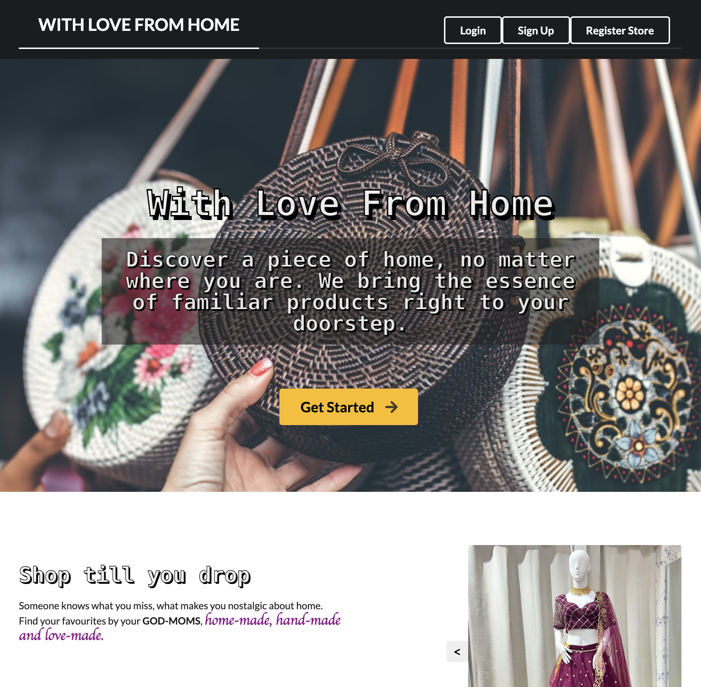

# With Love From Home

[Live](https://with-love-from-home.netlify.app/)

With Love From Home is a full-stack E-commerce web application that enables users to register as a store, create and sell products, and register as a customer to browse and purchase products with ease. The front-end is developed using the React framework, while the back-end is handled by Ruby on Rails. Additionally, an email system is implemented to notify both stores and customers, enhancing communication throughout the platform.

[Demo](https://youtu.be/IEl0hS8OP2k?si=YD3s1IO9joqKyV2Y)

[](https://youtu.be/IEl0hS8OP2k?si=YD3s1IO9joqKyV2Y "With Love From Home")

## Features

- **Store Registration:** Stores can register on the platform to create and manage their product listings.

[Register](./storereg.png)

- **Product Management:** Stores can add, edit, and delete products, providing a seamless way to showcase their offerings.

[Products Management](./edit.png)

[Order Management](./order.png)

- **Customer Registration:** Customers can register on the platform, allowing them to browse and purchase products.

- **Shopping Cart:** Customers can add products to their shopping cart, review selections, and proceed to checkout.

- **Order Processing:** The platform supports order processing, including payment integration for a complete shopping experience.

- **Email Notifications:** An email system is implemented to notify both stores and customers about important events, such as order confirmation and product updates.


## Tech Stack

- **Front-end:** React, Redux, React Hooks
- **Back-end:** Ruby on Rails
- **Database:** PostgreSQL
- **Email System:** Gmail SMTP


## Installation

1. **Clone the Repository:**

   ```bash
   git clone https://github.com/yourusername/with-love-from-home.git


2. **Install Dependencies:**

   ```bash
   npm install


3. **Open your browser and visit http://localhost:3000 to access the application.**


## Usage 

- • Visit the deployed application or run it locally using the steps mentioned in the Installation section.

- • Register as a store or a customer and explore the features provided by the platform.


## Contributing

We welcome contributions from the community. If you find any issues or have ideas for improvements, please open an issue or submit a pull request on the GitHub repository.


## License

This project is licensed under the MIT License.

# Please drop comments. I highly appreciate them!